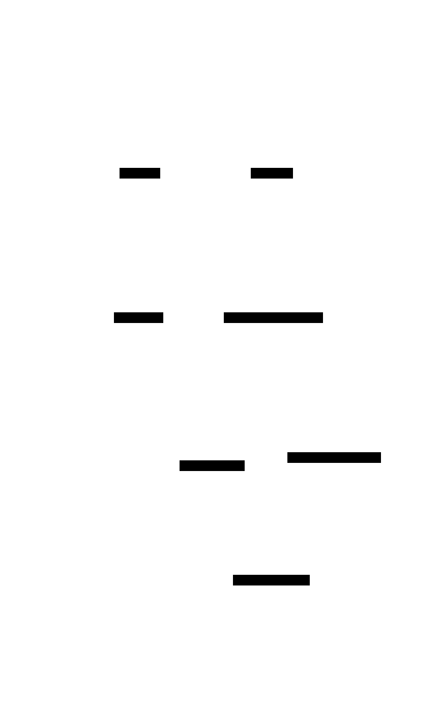

<div align="center">

# 👁️ aeye

**A terminal image carousel for coding agents** — browse every screenshot,
render, and image your agent touches, without leaving the terminal.

*aeye* = "agent eye" — every agent needs aeye.

[](https://github.com/noamsto/aeye/actions/workflows/ci.yml)
[](LICENSE)
[](go.mod)

</div>

https://github.com/user-attachments/assets/56da40a2-29c7-4e88-b618-91a703a4c325

A big **preview** of the selected image plus a **filmstrip** of thumbnails,
rendered in a tmux split or kitty window (dual-mode). One half **captures** every
image a coding-agent session touches (reads, writes, screenshots); the other
**renders** them and auto-refreshes as new ones arrive — so you can glance at
what your agent is doing without leaving the terminal.

## Features

- 🖼️ **Preview + filmstrip** — a large view of the selected image above a
  scrollable strip of thumbnails.
- 🪄 **Auto-capture** — a PostToolUse hook records every image the session reads,
  writes, or screenshots into a per-pane manifest. Nothing to do by hand.
- 🔭 **Multi-host rendering** — a tmux split, a kitty/wezterm split, or a ghostty
  window, auto-detected from the host. Opens beside your agent, not wherever you
  happened to navigate. See [Terminal support](#terminal-support).
- ⚡ **Live** — opens on the newest image and follows new captures as they stream
  in, until you take over with the keyboard; polls for changes every ~1.5s.
- ✨ **Crisp** — kitty graphics protocol on kitty/ghostty, with a
  [`chafa`](https://hpjansson.org/chafa/) block-art fallback everywhere else.
- 🧹 **Robust** — skips deleted or corrupt entries instead of rendering blank
  cells; logs why, for when you wonder where an image went.
- 📊 **Diagrams (optional)** — the agent can draw [D2](https://d2lang.com)
  diagrams that render straight into the carousel as sharp, zoomable vectors,
  with group-by-group drill-down and labels that auto-contrast against their fill.

## Install

Two PATH entrypoints — the `aeye` viewer and the `tmux-claude-images`
toggle that opens it. Install **both** (the toggle launches the viewer into a
fresh pane, which resolves `aeye` from that pane's PATH).

**Prebuilt binaries** — no toolchain, Linux/macOS · amd64/arm64. Downloads both
entrypoints:

```bash
os=$(uname -s | tr '[:upper:]' '[:lower:]'); arch=$(uname -m)
case $arch in x86_64) arch=amd64 ;; aarch64|arm64) arch=arm64 ;; esac
mkdir -p ~/.local/bin   # ensure this is on your PATH
curl -fsSL "https://github.com/noamsto/aeye/releases/latest/download/aeye_${os}_${arch}.tar.gz" \
  | tar -xz -C ~/.local/bin aeye tmux-claude-images
```

(Or download an archive from the [releases page](https://github.com/noamsto/aeye/releases) and extract both onto your PATH.)

**Nix:**

```bash
nix profile install github:noamsto/aeye          # viewer
nix profile install github:noamsto/aeye#toggle   # toggle
```

**Go** — viewer only; pair it with the toggle from the release archive or
`scripts/tmux-claude-images.sh`:

```bash
go install github.com/noamsto/aeye@latest
```

Then install the **capture** half for your coding agent.

**Claude Code** (run inside Claude Code, not the shell):

```
/plugin marketplace add noamsto/aeye
/plugin install aeye@aeye
```

**Codex CLI** (run in a shell; the marketplace root is `adapters/codex/`, not
the repo root):

```bash
codex plugin marketplace add <path-to-aeye>/adapters/codex
codex plugin add aeye@aeye
```

Codex skips a plugin's hooks until you review and trust them: run `/hooks`
inside Codex once after installing, and again after any plugin update (trust
is keyed to the hooks' hash).

> 📖 **Step-by-step, agent-friendly guide:** [`docs/INSTALL.md`](docs/INSTALL.md)
> — host check, both entrypoints, plugin, optional deps, and a smoke test, each
> with a verification command.

<details>
<summary>Via lazytmux (Nix / Home Manager)</summary>

[lazytmux](https://github.com/noamsto/lazytmux) consumes this repo as a flake
input — it puts the viewer and `tmux-claude-images` on PATH and binds
`prefix + I`. If you run lazytmux you already have the carousel; just add the
plugin above for capture.

</details>

## Usage

Ask your agent to *show the images from this conversation* (or invoke the
`image-gallery` skill), or open it yourself:

```bash
tmux-claude-images   # toggle: run again to close. In tmux, also prefix + I (lazytmux)
```

It does nothing until images have been captured — the manifest fills as the
session reads/writes/screenshots images.

### Keybindings

| Key | Action |
|---|---|
| `←` `→` `↑` `↓` / `h` `l` `k` `j` | Move selection (**pan** when zoomed in) |
| `n` / `p` | Page the filmstrip |
| `g` / `G` (or `Home` / `End`) | First / last image |
| `1`–`9` | Jump to the Nth image |
| `z` `+` `=` / `Z` `-` `_` | Zoom in / out |
| `Enter` / `o` | Open in the default app |
| `O` | Open the containing folder |
| `y` | Copy the selected image to the clipboard |
| `d` | Drag the selected image out — in kitty just drag it with the mouse; `d` opens a `ripdrag`/`dragon` window elsewhere, else copies to the clipboard |
| `x` | Delete the selected image — marks it for deletion with a 5s undo window; press `u` to undo, or it's removed from disk when the countdown ends |
| `s` | Toggle the carousel between a side and bottom split (tmux only) |
| `r` | Reload the manifest |
| `q` / `Ctrl-C` | Quit |

When zoomed in, the arrows/`hjkl` pan the preview instead of moving the
selection — use `n`/`p`/`g`/`G` (or `0`/`Esc`) to change image while zoomed.

#### Diagrams (D2)

Diagrams render as sharp vectors and gain a few extra keys for exploring their
structure — group by group — when one is selected:

| Key | Action |
|---|---|
| `Tab` / `Shift+Tab` | Cycle through regions/groups (`Shift+Tab` from the first backs out to the whole diagram) |
| `]` / `[` | Drill into / out of the focused region |
| `0` / `Esc` | Reset zoom and return to the whole diagram |

## Terminal support

Two things vary by host: **where** the viewer opens, and **how sharp** the images
are. Crisp rendering needs the kitty graphics protocol's *unicode placeholders*
(U+10EEEE); everything else uses the [`chafa`](https://hpjansson.org/chafa/)
block-art fallback.

| Host (no tmux) | Window placement | Image quality |
|----------------|------------------|---------------|
| **kitty** | split beside the agent (`kitty @ launch`) | crisp |
| **ghostty** | separate window (`ghostty +new-window` / `open -na`) | crisp |
| **wezterm** | split beside the agent (`wezterm cli split-pane`) | chafa\* |
| **Alacritty / Warp / other** | — (use tmux) | chafa |

Inside **tmux** the viewer always opens as a split, on any host. WezTerm speaks
the kitty protocol but not its unicode placeholders ([wezterm#986](https://github.com/wezterm/wezterm/issues/986)),
so it uses chafa today and would upgrade automatically if that lands.

\* Crisp real-pixel rendering on wezterm/iTerm2 (sixel / OSC 1337) is tracked
separately.

**Drag-out.** In **kitty ≥ 0.47** (outside tmux) you drag the selected image
straight out of the preview with the mouse — a thumbnail follows the cursor —
using kitty's [OSC 72](https://sw.kovidgoyal.net/kitty/dnd-protocol/) protocol;
no key needed. Everywhere else, the `d` key opens a small drag window via
[`ripdrag`](https://github.com/nik012003/ripdrag) or
[`dragon`](https://github.com/mwh/dragon) if one is on PATH (Linux/X11/Wayland),
and otherwise copies the image to the clipboard.

`AEYE_SPLIT` controls where the viewer opens its split, on any backend: `auto`
(default) splits along the window's longer axis, `side` forces a left/right
split, `bottom` forces a top/bottom split. In tmux, press `s` in the viewer to
toggle it live.

### Enable kitty-pane mode (native drag-out inside tmux)

Native drag-out needs a real kitty pane — tmux can't carry the protocol. To make
the viewer open as a kitty split instead of a tmux split while you work in tmux:

1. **kitty** — allow remote control on a stable socket (`kitty.conf`):
   ```
   allow_remote_control yes
   listen_on unix:/tmp/kitty-{kitty_pid}
   ```
2. **tmux** — let panes see kitty's socket and the mode flag (`tmux.conf`):
   ```
   set -ga update-environment "KITTY_LISTEN_ON AEYE_HOST"
   ```
3. **Opt in** — `export AEYE_HOST=kitty`.

If the socket isn't reachable, aeye falls back to a tmux split (drag-out then
uses `ripdrag`/`dragon` or the clipboard).

**Seamless `Ctrl-hjkl`.** Once kitty-pane mode is on, the carousel viewer crosses
back into tmux on `Ctrl-h/j/k/l` itself (via `kitty @ action neighboring_window`)
— no kitty config needed. For the tmux→carousel direction, your tmux nav bindings
must hand off to kitty at the pane edge. lazytmux ships this; for a hand-rolled
`tmux.conf`, route `Ctrl-hjkl` through a helper that, at the edge with
`KITTY_LISTEN_ON` set, runs `kitty @ action neighboring_window <dir>` instead of
`select-pane` (see `lazytmux` `scripts/tmux-smart-nav.sh`).

### Debugging the carousel

Set `AEYE_DEBUG` to trace the viewer's first-frame lifecycle (issue #125-class
glitches):

- `AEYE_DEBUG=1` (or `true`/`on`) → writes `<state-dir>/<key>.trace.log` (beside the manifest),
  fresh on each open.
- `AEYE_DEBUG=/path/to/file` → writes there. This truncates (overwrites) the file on each
  open, so don't point it at a file you want to keep.

To leave it on, set it where the *launcher* runs:
- tmux keybinding: `tmux set-environment -g AEYE_DEBUG 1`
- `/aeye` skill / auto-open hook: export it in your shell profile.

The launcher forwards it into the spawned viewer on every host (tmux/kitty/wezterm/ghostty/iterm) when set.

## Architecture

<picture>
  <source media="(prefers-color-scheme: dark)" srcset="docs/assets/architecture-dark.svg">
  
</picture>

The viewer is **agent-agnostic**. It renders a per-pane manifest and has no
knowledge of which agent produced it — the [manifest JSONL](docs/MANIFEST.md) is
the stable interface. Each agent gets a small **capture adapter** that appends to
the manifest; the viewer never changes.

- **Viewer** (Go binary) — reads
  `${AEYE_DIR:-${CLAUDE_STATUS_DIR:-/tmp/claude-status}}/images/<pane>.jsonl`
  and renders via the kitty graphics protocol (or chafa fallback).
- **Adapters** (`adapters/`) — per-agent capture, at parity: `claude-code/`
  and `codex/` (each a PostToolUse/SessionStart hook + plugin + skill).

Extracted from [lazytmux](https://github.com/noamsto/lazytmux), which consumes
this repo as a flake input.

## Status

Live standalone repo — the viewer binary, the Claude Code and Codex capture
adapters, and plugin skills all build and are consumed by
[lazytmux](https://github.com/noamsto/lazytmux) as a flake input. Zoom/pan and D2
diagram navigation are implemented; see
[docs/2026-06-10-design.md](docs/2026-06-10-design.md) for the design notes.
