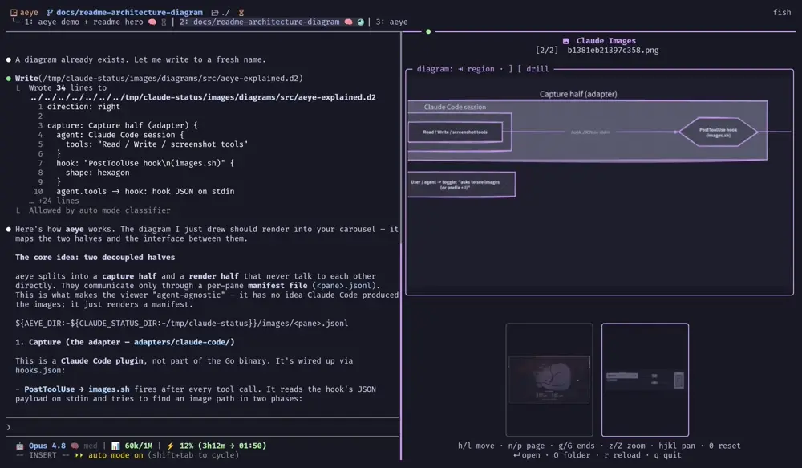

<div align="center">

# 👁️ aeye

**A terminal image carousel for coding agents** — browse every screenshot,
render, and image your agent touches, without leaving the terminal.

*aeye* = "agent eye" — every agent needs aeye.

[](https://github.com/noamsto/aeye/actions/workflows/ci.yml)
[](LICENSE)
[](go.mod)

</div>

<div align="center">

[](docs/assets/demo.mp4)

<sub>Drilling into a D2 diagram in the carousel — <a href="docs/assets/demo.mp4">click for the full walkthrough</a>.</sub>

</div>

A big **preview** of the selected image plus a **filmstrip** of thumbnails,
rendered in a tmux split or kitty window (dual-mode). One half **captures** every
image a coding-agent session touches (reads, writes, screenshots); the other
**renders** them and auto-refreshes as new ones arrive — so you can glance at
what your agent is doing without leaving the terminal.

## Features

- 🖼️ **Preview + filmstrip** — a large view of the selected image above a
  scrollable strip of thumbnails.
- 🪄 **Auto-capture** — a PostToolUse hook records every image the session reads,
  writes, or screenshots into a per-pane manifest. Nothing to do by hand.
- 🔭 **Dual-mode rendering** — a tmux split or a kitty window, auto-detected from
  the host. Opens beside your agent, not wherever you happened to navigate.
- ⚡ **Live** — opens on the newest image and follows new captures as they stream
  in, until you take over with the keyboard; polls for changes every ~1.5s.
- ✨ **Crisp** — kitty graphics protocol on kitty/ghostty, with a
  [`chafa`](https://hpjansson.org/chafa/) block-art fallback everywhere else.
- 🧹 **Robust** — skips deleted or corrupt entries instead of rendering blank
  cells; logs why, for when you wonder where an image went.
- 📊 **Diagrams (optional)** — the agent can draw [D2](https://d2lang.com)
  diagrams that render straight into the carousel as sharp, zoomable vectors,
  with group-by-group drill-down and labels that auto-contrast against their fill.

## Install

Two PATH entrypoints — the `aeye` viewer and the `tmux-claude-images`
toggle that opens it. Install **both** (the toggle launches the viewer into a
fresh pane, which resolves `aeye` from that pane's PATH).

**Prebuilt binaries** — no toolchain, Linux/macOS · amd64/arm64. Downloads both
entrypoints:

```bash
os=$(uname -s | tr '[:upper:]' '[:lower:]'); arch=$(uname -m)
case $arch in x86_64) arch=amd64 ;; aarch64|arm64) arch=arm64 ;; esac
mkdir -p ~/.local/bin   # ensure this is on your PATH
curl -fsSL "https://github.com/noamsto/aeye/releases/latest/download/aeye_${os}_${arch}.tar.gz" \
  | tar -xz -C ~/.local/bin aeye tmux-claude-images
```

(Or download an archive from the [releases page](https://github.com/noamsto/aeye/releases) and extract both onto your PATH.)

**Nix:**

```bash
nix profile install github:noamsto/aeye          # viewer
nix profile install github:noamsto/aeye#toggle   # toggle
```

**Go** — viewer only; pair it with the toggle from the release archive or
`scripts/tmux-claude-images.sh`:

```bash
go install github.com/noamsto/aeye@latest
```

Then install the **capture** half — the Claude Code plugin (run inside Claude
Code, not the shell):

```
/plugin marketplace add noamsto/aeye
/plugin install aeye@aeye
```

> 📖 **Step-by-step, agent-friendly guide:** [`docs/INSTALL.md`](docs/INSTALL.md)
> — host check, both entrypoints, plugin, optional deps, and a smoke test, each
> with a verification command.

<details>
<summary>Via lazytmux (Nix / Home Manager)</summary>

[lazytmux](https://github.com/noamsto/lazytmux) consumes this repo as a flake
input — it puts the viewer and `tmux-claude-images` on PATH and binds
`prefix + I`. If you run lazytmux you already have the carousel; just add the
plugin above for capture.

</details>

## Usage

Ask your agent to *show the images from this conversation* (or invoke the
`image-gallery` skill), or open it yourself:

```bash
tmux-claude-images   # toggle: run again to close. In tmux, also prefix + I (lazytmux)
```

It does nothing until images have been captured — the manifest fills as the
session reads/writes/screenshots images.

### Keybindings

| Key | Action |
|---|---|
| `←` `→` `↑` `↓` / `h` `l` `k` `j` | Move selection (**pan** when zoomed in) |
| `n` / `p` | Page the filmstrip |
| `g` / `G` (or `Home` / `End`) | First / last image |
| `1`–`9` | Jump to the Nth image |
| `z` `+` `=` / `Z` `-` `_` | Zoom in / out |
| `Enter` / `o` | Open in the default app |
| `O` | Open the containing folder |
| `r` | Reload the manifest |
| `q` / `Ctrl-C` | Quit |

When zoomed in, the arrows/`hjkl` pan the preview instead of moving the
selection — use `n`/`p`/`g`/`G` (or `0`/`Esc`) to change image while zoomed.

#### Diagrams (D2)

Diagrams render as sharp vectors and gain a few extra keys for exploring their
structure — group by group — when one is selected:

| Key | Action |
|---|---|
| `Tab` / `Shift+Tab` | Cycle through regions/groups (`Shift+Tab` from the first backs out to the whole diagram) |
| `]` / `[` | Drill into / out of the focused region |
| `0` / `Esc` | Reset zoom and return to the whole diagram |

## Architecture

The viewer is **agent-agnostic**. It renders a per-pane manifest and has no
knowledge of which agent produced it — the [manifest JSONL](docs/MANIFEST.md) is
the stable interface. Each agent gets a small **capture adapter** that appends to
the manifest; the viewer never changes.

- **Viewer** (Go binary) — reads
  `${AEYE_DIR:-${CLAUDE_STATUS_DIR:-/tmp/claude-status}}/images/<pane>.jsonl`
  and renders via the kitty graphics protocol (or chafa fallback).
- **Adapters** (`adapters/`) — per-agent capture. Today: `claude-code/`
  (a PostToolUse hook + plugin + skill).

Extracted from [lazytmux](https://github.com/noamsto/lazytmux), which consumes
this repo as a flake input.

## Status

Live standalone repo — the viewer binary, Claude Code capture adapter, and plugin
skill all build and are consumed by
[lazytmux](https://github.com/noamsto/lazytmux) as a flake input. Zoom/pan and D2
diagram navigation are implemented; see
[docs/2026-06-10-design.md](docs/2026-06-10-design.md) for the design notes.
